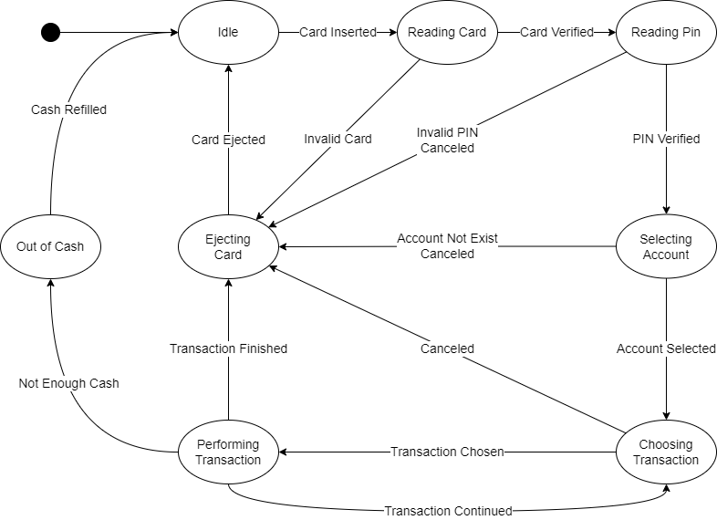

# MyAtmMachine
My automated teller machine (ATM) controller, implemented by finite state machine (FSM) pattern.

## Atm States
States of my ATM machine are as follow.  

### Initializing
ATM need initialization.  
Available Actions:
* Initialize

### Idle
Idle state with an empty card reader.  
Available Actions:
* Insert Card
### Reading Card
ATM is currently reading and verifying inserted card.

### Reading Pin
User have to enter PIN to proceed.  
Available Actions:
* Enter PIN
* Cancel

### Selecting Account
User have to select an account to proceed.  
Available Actions:
* Select Account
* Cancel

### Choosing Transaction
User can start the transaction.  
Available Actions:
* See Balance
* Withdraw
* Deposit
* Cancel

### Performing Transaction
ATM is performing Transaction

### Ejecting Card
ATM is ejecting card.  

### Out of Cash
ATM is out of cash.

### Out of Order
ATM is out of order.