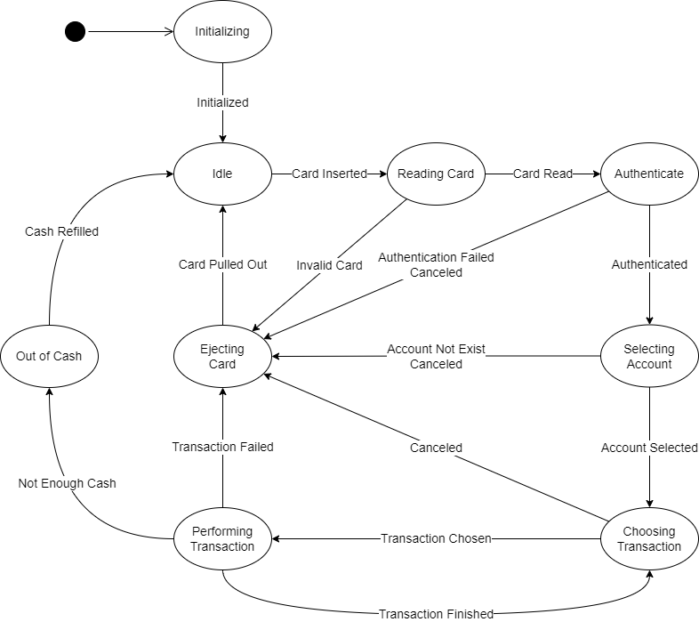

# MyAtmMachine
My automated teller machine (ATM) controller, implemented using finite state machine (FSM).

## Environment
Tested on below environment
```
OS: Ubuntu 20.04
Compiler: gcc 9.3.0
cmake version 3.16.3
```

## Build and Test
```bash
# Install dependencies
sudo apt-get update
sudo apt-get install -y build-essential cmake

# Clone project and init submodules
git clone https://github.com/tldnr514/MyAtmMachine.git
cd MyAtmMachine
git submodule update --init --recursive

# Build library and tests
mkdir build
cd $_
cmake ..
make

# Execute tests
ctest --verbose
```

## Atm States


States of my ATM machine are as follow.  
### Initializing
ATM need initialization.  
Available Actions:
* Initialize

### Idle
Idle state with an empty card reader.  
  
### Reading Card
ATM is reading inserted card.

### Authenticating
User have to enter PIN to proceed.  
Available Actions:
* Enter PIN
* Cancel

### Selecting Account
User have to select an account to proceed.  
Available Actions:
* Select Account
* Cancel

### Choosing Transaction
User can start a transaction.  
Available Actions:
* See Balance
* Withdraw
* Deposit
* Cancel

### Performing Transaction
ATM is performing a transaction

### Ejecting Card
ATM is ejecting card.  

### Out of Cash
ATM is out of cash.

### Out of Order
ATM is out of order.